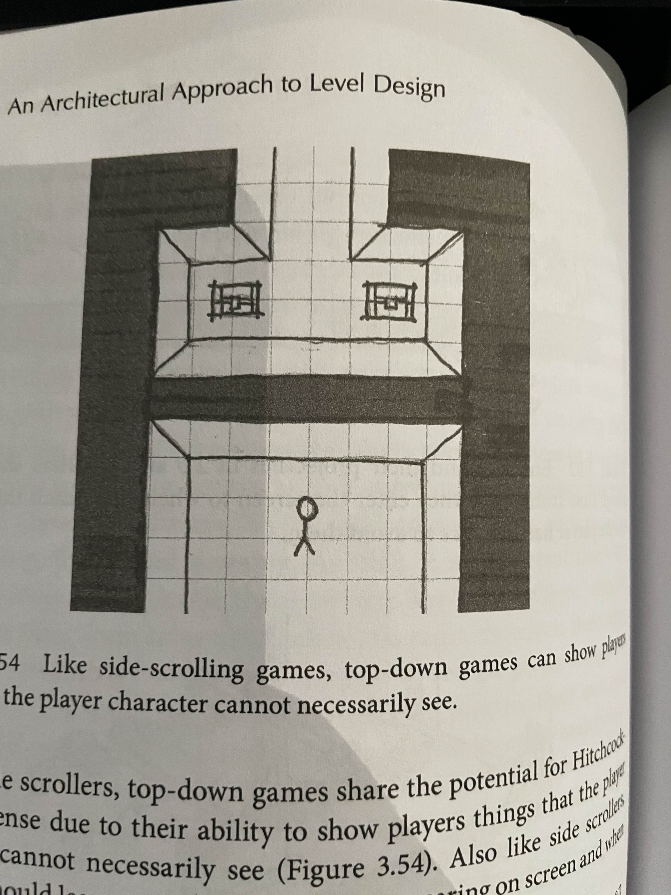
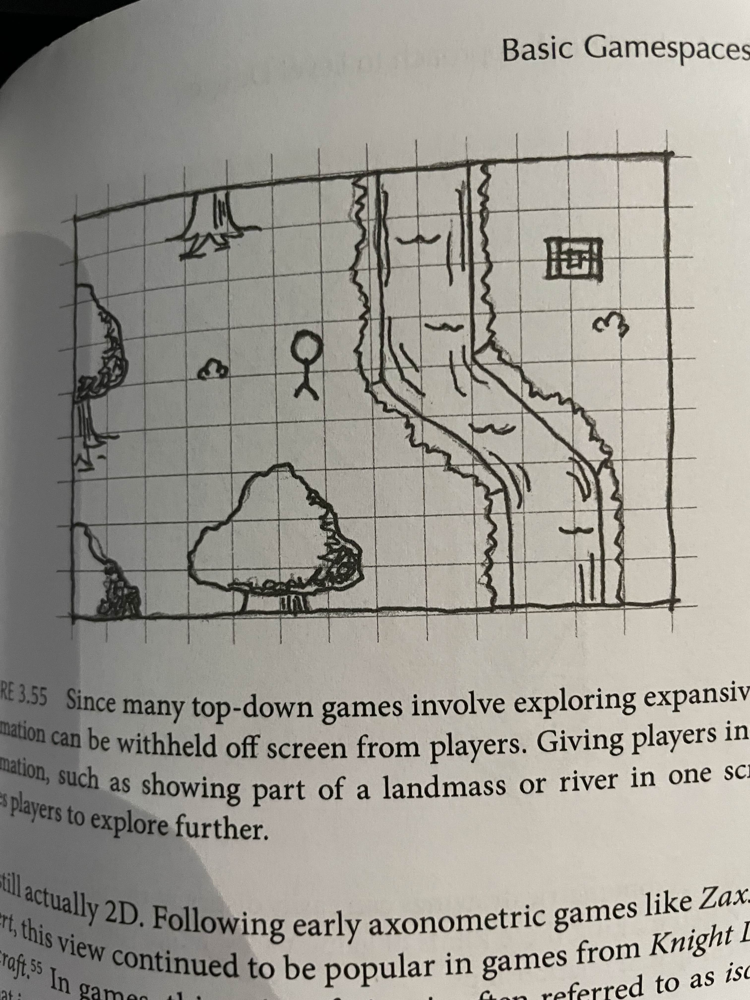

# Level design for infinitely generated worlds

In this research I'm looking into how to make the bridge between intentional & clean level design towards infinitely procedural world generation. This subject has interested me pretty deeply over the last few months and I'm excited to dive deeper into it. This research will mostly be from a game designers perspective but I will also be looking out for possible solutions for implementing certain level design principles.

*Note: This is by no means my final product, consider it more of a scratchbook where I write out my conclusions and ideas that will later be molded into a respectable thesis and hopefully an amazing demo!*
## Architectural spartial arrangements

Source: An Architectural perspective to level design page: 104 - 112

### Arrivals
A very interesting topic I just have to note down is **Arrivals**. As the book states "Level esign is an art of sight lines, pathways, dramatic lead-ups, and ambiguity about the nature of where you are going.". Much of the communication to the player happens through the arrival in a space.

A big subject I now want to write about is the long round way around walking to the Patrthenon. I find this to be a very interesting concept that has a lot of potential to be implemented procedurally.

The idea is on how the road forces you to walk around the building seeing it from all angles, from afar from the side from the back really building up the moment you finally get in front. I find this a very nice way to giving players a goal and to build up anticipation procedurally!

When building a procedural world in simple terms: As I want to work with a modular principle like minecraft the world will be cut into different parts where different worlds can spawn upon. Imagine I want to make a world that has a "Parthenon" type building in the center. If I where to wrap the uv's of the mountains around this building towards the center using a neat function named Arctangent2

Now our mountains are pulled to the center of the world, so what if instead of just traight mountains we can just twirl hat same vector, yeah ofcorse that's possible !

Now we spawn mountains that delay your path but give way for differences in height, we can move the center to be more to the back for longer walks or closer by so the start of the area is more visible from other regions, the ending can be in an elevated position or maybe its deep under ground, either way using smoothstep in the center area we can smoothly make the mountains blend with our building in the center!

This might work!!!

There is still a lot to go through here but I'l excited to try this out!

## Considerations of camera

Source: an architectual approach to level design 144-155

Another very interesting subject is the consideration of camera! Speicically the example of how side scrolling games and top down games can show players things that the player character cannot nessesairly see.

As my game will be a volumetric 3D world I like to think in that perspective but ofcorse this means an idea like that would be impossible. But I really like the idea of teasing a potential loot drop or maybe impactful area before you can reach it... Like a hot or cold effect, imagine you are a robot looking for energy sources, you are exploring a cave and you get an energy reading, just like bluetooth from your phone goes through the walls you can also notice readings, ofcorse as you get closer the connection will get stronger until it gets so close you can even see it through walls!

**BEHOLD MY CRAZY CONCEPT ART, MY PREPROCESSING TEACHER WOULD DEFINITLY SHOOT ME** (Altough he's like one of the most wholesome teachers ever, I think he'd have a giggle and say "well at least I see what you mean")

Anyway! As we are making the bridge between infinitely procedurally generated worlds and good level design what does thinking about this do for that goal? Well stuff can be all over the place, imagine you walk in a dungeon to loot, as it could function as an extra stimulus to explore, you explore a dungeon slay monsters and then learn deep down (can even pick up signals from below you) is some rare item. Yes could definitly work in a non procedural world that's for sure! But the longer I think about good game design in procedural worlds, the more I believe I should just consider it more as a big open world where you have no clue what's going on like without any walkthrough or anything over just an open world. I'm starting to feel like helping the player navigate this messy space and guiding them through the game over an uniquely generated path etc is what makes a procedural world shine! In my enquete many people decided that exploration is the most important thing for them in open world games so level design that encourages exploration gives goals etc will be a beautiful addition to this research!